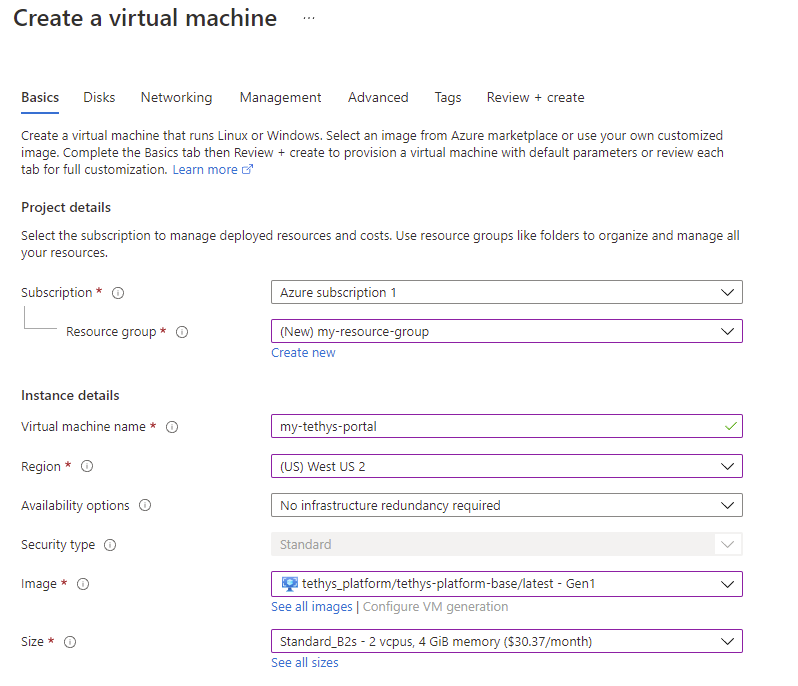

.. _azure_vm_create:

***************
Create Azure VM
***************

**Last Updated:** November 2021

1. Login to Azure Portal
========================

Navigate to https://azure.microsoft.com/ and Sign In using the **Sign in** link. Open the user dropdown menu and click on the **Azure Portal** link.

.. figure:: images/create--azure-portal.png
    :width: 800px
    :alt: Azure Portal link in the user menu

    **Figure 1.** Azure Portal link in the user menu.

2. Search for Tethys Platform image
===================================

Use the search bar to search for "Tethys Platform". Then select the **Tethys Platform 3.3 Ubuntu 20.04** item under the **Marketplace** category.

.. figure:: images/create--search-tethys.png
    :width: 800px
    :alt: Search for the Tethys Platform image in the Azure Marketplace

    **Figure 2.** Search for the Tethys Platform image in the Azure Marketplace.

3. Create virtual machine
=========================

Click on the **Create** button to create a new virtual machine using the Tethys Platform image.

.. figure:: images/create--create-virtual-machine.png
    :width: 800px
    :alt: Create a new virtual machine

    **Figure 3.** Create a new virtual machine.

4. Configure virtual machine
============================

Fill in the "Create a virtual machine" form as follows:

Project Details
---------------

* **Subscription**: Select the desired subscription that will be used for billing the virtual machine usage.
* **Resource group**: Select a resource group or create a new one using the **Create new** link.

Instance Details
----------------

These are technical details about the virtual machine that will be created.

* **Virtual machine name**: Give the virtual machine a name.
* **Region**: Select an appropriate region, this is the approximate location of the data center where the virtual machine will be created.
* **Image**: Should be filled with **Tethys Platform 3.3 - Gen1** already.
* **Size**: Choose the size of hardware for your virtual machine. We recommend a machine with at least 2 cpus (vcpus) and 4 GiB of memory (e.g. Standard_B2s). Click on the **See all sizes** link to see a list of all the sizes to compare costs.

Administrator account
---------------------

Specify the credentials for the administrator account as well. This account will be used to log in to the virtual machine:

* **Authentication type**: We recommend using SSH public keys, but you can use a password if you are not sure what an SSH key is.
* **Username**: See caution below.
* **SSH public key source** and **Key pair name**: if using SSH keys, you can choose to create a new key pair or use an existing key pair if you have one already.

.. caution::

    Do not use a generic user name like "admin". We also do not recommend that you use the "tethys" username for security reasons. Consider using a tool like `Random Username Generator | Jimpix <https://jimpix.co.uk/words/random-username-generator.asp>`_.

Inbound port rules
------------------

* **Public inbound ports**: Select **Allow selected ports**.
* **Select inbound ports**:
    * **SSH (22)**
    * **HTTP (80)**
    * **HTTPS (443)** (if planning to enable HTTPS)

Licensing
---------

* **License type**: Select **Other**.

    **Figure 4.** Example of the "Create a virtual machine" form.

5. Create disks
===============

Press the **Next: Disks >** button to proceed to the **Disks** tab. You will create the hard drive for the virtual machine to use on this page.

Disk Options
------------

* **OS disk type**: Select the type of disk you'd like the VM to have. We'd recommend one of the SSD options. Standard SSD should work for a lot of deployments, but if you plan to use GeoServer, you may want to consider Premium SSD for better performance.
* **Encryption type**: adjust to taste.

Data disks (optional)
---------------------

Use this section to attach additional disks to the VM if you'd like (see: :ref:`Add Additional Storage <azure_vm_config_storage>`).

6. Review other tabs
====================

The default options in the other tabs should be ok, but take a few minutes to click through the tabs and review the options.

When you are done, click on the **Review + create** button.

7. Review and create
====================

Review the options and make any changes if needed. Then press the **Create** button.

.. attention::

    If you chose to generate a new key pair, don't forget to download the private key. Keep this file in a safe place and don't lose it.

8. Twiddle thumbs
=================

It will take a few minutes for the virtual machine and side-car resources to be created. You should be taken to a progress page like the one below that will keep you apprised of the deployment status.

.. figure:: images/create--deploy-progress.png
    :width: 800px
    :alt: Virtual machine deployment progress page

    **Figure 5.** Deployment progress page.

9. Review resource page
=======================

When finished, the progress page will report something like "Your deployment is complete". At this point, press the **Go to resource** button.

This will bring you to the Overview page of the Virtual Machine. This view provides a sort of dashboard for the virtual machine and provides controls for starting, stopping, and connecting to the virtual machine.

Take a few minutes to familiarize yourself with the Overview page. If you are feeling brave you may also want to click through the other links in the navigation on the left to familiarize you with their content.

.. figure:: images/create--virtual-machine-overview.png
    :width: 800px
    :alt: Virtual machine resource overview page

    **Figure 6.** Virtual machine resource overview page.

.. _azure_vm_create_view_portal:

10. View the Tethys Portal
==========================

A few minutes after the Virtual Machine starts, Tethys Portal should be viewable. Locate the **Public IP address** field in the **Essentials** section (top-right). This is the IP address the virtual machine and where you can access it for now.

a. Press the **Copy to clipboard** button next to the IP address.

.. figure:: images/create--copy-public-ip.png
    :width: 800px
    :alt: Copy the public IP address

    **Figure 7.** Copy the public IP address.

b. Paste the IP address in the address bar of a new tab in your web browser. A default version of Tethys Portal should be displayed.

.. figure:: images/create--tethys-portal.png
    :width: 800px
    :alt: Tethys Portal running on Azure VM

    **Figure 8.** Tethys Portal running on Azure VM.

.. note::

    It can take Tethys Platform a few minutes to start up after the VM starts. If you receive a 502 Gateway error, wait a few minutes and try again.

Additional Resources
====================

Use the following resources to learn more about creating Virtual Machines on Microsoft Azure:

* `Virtual machines in Azure <https://docs.microsoft.com/en-us/azure/virtual-machines/>`_
* `Quickstart: Create a Linux virtual machine in Azure portal <https://docs.microsoft.com/en-us/azure/virtual-machines/linux/quick-create-portal>`_
* `Create a Linux virtual machine in Azure <https://docs.microsoft.com/en-us/learn/modules/create-linux-virtual-machine-in-azure/>`_
* `VM deployment issues <https://docs.microsoft.com/en-us/troubleshoot/azure/virtual-machines/welcome-deployment-troubleshooting>`_

What's Next?
============

Congratulations! You have a Tethys Portal running in Azure. In the next tutorial you will learn how connect to the VM and learn about what is installed on it.