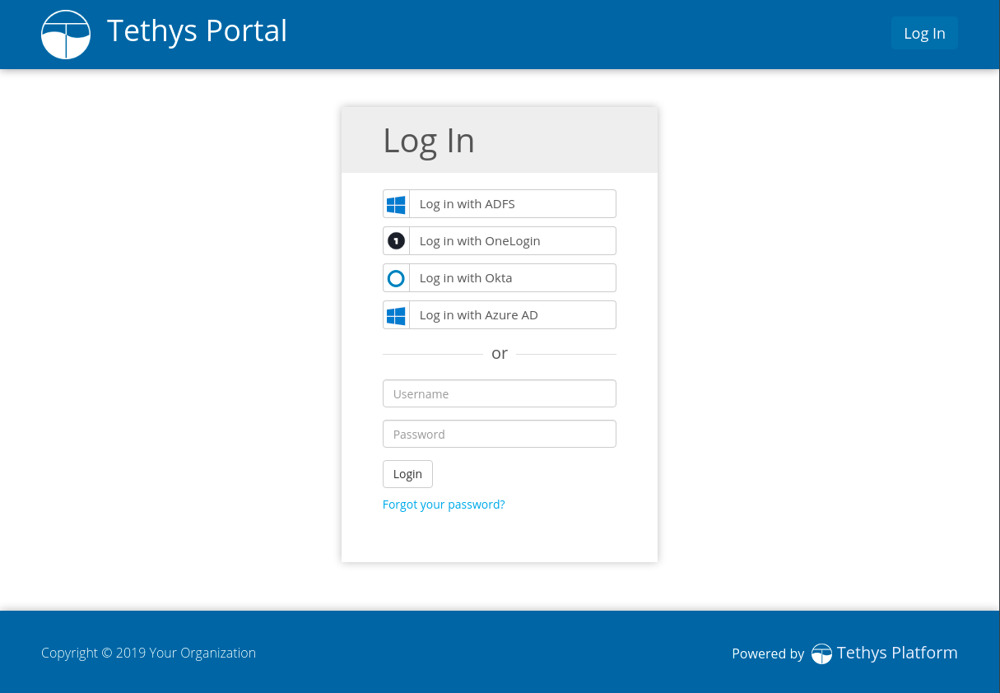

.. _single_sign_on_config:

*************************
Single Sign On (Optional)
*************************

**Last Updated:** December 2020

Tethys Portal supports authenticating users with several social authentication and single sign on providers such as Google, Facebook, and LinkedIn via the OAuth 2.0 method. The social authentication and authorization features have been implemented using the `Python Social Auth <http://psa.matiasaguirre.net/>`_ module and the social buttons provided by the `Social Buttons for Bootstrap <http://lipis.github.io/bootstrap-social/>`_. Social login is disabled by default, because enabling it requires registering your tethys portal instance with each provider.

Enable Social Login
===================

Use the following instructions to setup social login for the providers you desire.

.. caution::

    Beginning with Tethys Platform 3.0 you must configure the social auth settings in the :file:`portal_config.yml` file. See :ref:`tethys_configuration` for more details on how to create and configure this file. For instructions on how to configure social auth for previous versions of Tethys Platform please refer to the documentation specific to your version.

.. _social_auth_azuread:

Azure Active Directory
----------------------

1. Sign up for a free Microsoft Developer account or sign in with an existing account if you already have one. See: `<https://azure.microsoft.com/en-us/free/>`_

2. Create an Azure AD or Azure AD B2C Tenant on `Microsoft Azure Portal <https://portal.azure.com/#home>`_ if you do not already have one. See: `Quickstart: Set up a tenant <https://docs.microsoft.com/en-us/azure/active-directory/develop/quickstart-create-new-tenant#social-and-local-accounts>`_

    .. note::

        Tethys Platform supports single sign on with both the Azure AD and Azure AD B2C environments.

3. Register a new application. See: `Register a new application using the Azure portal <https://docs.microsoft.com/en-us/azure/active-directory/develop/quickstart-register-app#register-a-new-application-using-the-azure-portal>`_

* Select **Web** as the type of app.
* Enter one of the following for the redirect URL:

    * If using an **Azure AD Tenant** and you selected either **Accounts in any organizational directory** or **Accounts in any organizational directory and personal Microsoft accounts**:

        .. code-block::

            http://<SERVER_DOMAIN_NAME>/oauth2/complete/azuread-oauth2/

    * If using an **Azure AD Tenant** and you selected **Accounts in this organizational directory only**:

        .. code-block::

            http://<SERVER_DOMAIN_NAME>/oauth2/complete/azuread-tenant-oauth2/

    * If using an **Azure AD B2C Tenant**:

        .. code-block::

            http://<SERVER_DOMAIN_NAME>/oauth2/complete/azuread-b2c/

4. On the **Overview** page of the **App Registration** you created in the previous step, note the **Application (client) ID** and **Directory (tenant) ID** for use in step 7.

5. Select **Certificates & secrets** from the menu on the left. Create a **Client Secret** and note it's value for use in step 7.

6. Enable the appropriate authentication backend:

    * If using an **Azure AD Tenant** and you selected either **Accounts in any organizational directory** or **Accounts in any organizational directory and personal Microsoft accounts**:

        .. code-block::

            tethys settings --set AUTHENTICATION_BACKENDS "['social_core.backends.azuread.AzureADOAuth2']"

    * If using an **Azure AD Tenant** and you selected **Accounts in this organizational directory only**:

        .. code-block::

            tethys settings --set AUTHENTICATION_BACKENDS "['social_core.backends.azuread_tenant.AzureADTenantOAuth2']"

    * If using an **Azure AD B2C Tenant**:

        .. code-block::

            tethys settings --set AUTHENTICATION_BACKENDS "['social_core.backends.azuread_b2c.AzureADB2COAuth2']"

7. Set the appropriate settings:

    * If using an **Azure AD Tenant** and you selected either **Accounts in any organizational directory** or **Accounts in any organizational directory and personal Microsoft accounts**:

        .. code-block::

            tethys settings --set OAUTH_CONFIG.SOCIAL_AUTH_AZUREAD_OAUTH2_KEY <Application/Client ID> --set OAUTH_CONFIG.SOCIAL_AUTH_AZUREAD_OAUTH2_SECRET <Client Secret>

    * If using an **Azure AD Tenant** and you selected **Accounts in this organizational directory only**:

        .. code-block::

            tethys settings --set OAUTH_CONFIG.SOCIAL_AUTH_AZUREAD_TENANT_OAUTH2_KEY <Application/Client ID> --set OAUTH_CONFIG.SOCIAL_AUTH_AZUREAD_TENANT_OAUTH2_SECRET <Client Secret> --set OAUTH_CONFIG.SOCIAL_AUTH_AZUREAD_TENANT_OAUTH2_TENANT_ID <Directory/Tenant ID>

    * If using an **Azure AD B2C Tenant**:

        .. code-block::

            tethys settings --set OAUTH_CONFIG.SOCIAL_AUTH_AZUREAD_B2C_OAUTH2_KEY <Application/Client ID> --set OAUTH_CONFIG.SOCIAL_AUTH_AZUREAD_B2C_OAUTH2_SECRET <Client Secret> --set OAUTH_CONFIG.SOCIAL_AUTH_AZUREAD_B2C_OAUTH2_TENANT_ID <Directory/Tenant ID> --set OAUTH_CONFIG.SOCIAL_AUTH_AZUREAD_B2C_OAUTH2_POLICY <Custom User Flow>

        .. note::

              Use ``b2c_`` as the value of ``SOCIAL_AUTH_AZUREAD_B2C_OAUTH2_POLICY`` if you do not have a custom user flow. See: `User flows in Azure Active Directory B2C <https://docs.microsoft.com/en-us/azure/active-directory-b2c/user-flow-overview>`_ for more information.

References
++++++++++

For more detailed information about using Azure Active Directory social authentication see the following articles:

* `Tutorial: Create an Azure Active Directory B2C tenant <https://docs.microsoft.com/en-us/azure/active-directory-b2c/tutorial-create-tenant>`_
* `Associate or add an Azure subscription to your Azure Active Directory tenant <https://docs.microsoft.com/en-us/azure/active-directory/fundamentals/active-directory-how-subscriptions-associated-directory?amp>`_
* `Microsoft Azure Active Directory - Python Social Auth <https://python-social-auth.readthedocs.io/en/latest/backends/azuread.html>`_

.. _social_adfs:

Active Directory Federation Services (AD FS)
--------------------------------------------

1. Coordinate with the administrator of your organization's Windows server that is running AD FS to create a new App Registration for your Tethys Portal (see Step 2).

    .. important::

        Tethys Platform only supports authenticating with **AD FS 2016 or later**.

2. Follow the `App Registration in AD FS <https://docs.microsoft.com/en-us/windows-server/identity/ad-fs/development/msal/adfs-msal-web-app-web-api#app-registration-in-ad-fs>`_ section of the `AD FS MSAL Web app (server app) calling web APIs <https://docs.microsoft.com/en-us/windows-server/identity/ad-fs/development/msal/adfs-msal-web-app-web-api>`_ documentation to register your Tethys Portal with the AD FS server with the following considerations:

    * On the **Welcome** tab:
        * Select **Server application accessing a web API** as the **Template**.
    * On the **Server application** tab:
        * Note the **Client Identifier** for use in Step 3.
        * Enter the following for the **Redirect URI**:

            .. code-block::

                    http://<SERVER_DOMAIN_NAME>/oauth2/complete/adfs-oidc/

    * On the **Configure Application Credentials** tab:
        * Note the **Secret** that is generated for use in Step 3.
    * On the *Configure Web API** tab:
        * Add the FQDN of your Tethys Portal as an **Identifier**.
    * On the **Configure Application Permissions** tab:
        * Only the **openid** scope is required. However, you may consider permitting the **email** and **profile** scopes as well to allow Tethys Portal to populate its user profile.

    .. important::

        You do not need to complete the **Code Configuration** section.

3. Add the appropriate settings to the  :file:`portal_config.yml` file using the ``tethys settings`` command:

    Add the ``tethys_services.backends.adfs.ADFSOpenIdConnect`` backend to the ``AUTHENTICATION_BACKENDS`` setting:

    .. code-block::

        tethys settings --set AUTHENTICATION_BACKENDS "['tethys_services.backends.adfs.ADFSOpenIdConnect']"

    Use the ``Client Identifier`` and ``Secret`` obtained in Step 2 to set the ``SOCIAL_AUTH_ADFS_OIDC_KEY`` and ``SOCIAL_AUTH_ADFS_OIDC_SECRET`` settings, respectively. Also, set the ``SOCIAL_AUTH_ADFS_OIDC_DOMAIN`` setting with the Fully Qualified Domain Name (FQDN) of your AD FS server (e.g. "https://adfs.my-org.com"):

    .. code-block::

        tethys settings --set OAUTH_CONFIG.SOCIAL_AUTH_ADFS_OIDC_KEY <Client Identifier> --set OAUTH_CONFIG.SOCIAL_AUTH_ADFS_OIDC_SECRET <Secret> --set OAUTH_CONFIG.SOCIAL_AUTH_ADFS_OIDC_DOMAIN <AD FS FQDN>

References
++++++++++

For more detailed information about using Active Directory Federation Services social authentication see the following articles:

* `Active Directory Federation Services <https://docs.microsoft.com/en-us/windows-server/identity/active-directory-federation-services>`_
* `AD FS OpenID Connect/OAuth Concepts <https://docs.microsoft.com/en-us/windows-server/identity/ad-fs/development/ad-fs-openid-connect-oauth-concepts>`_

.. _social_auth_facebook:

Facebook
--------

1. Create a Facebook Developer Account

    You will need a Facebook developer account to register your Tethys Portal with Facebook. To create an account, visit `https://developers.facebook.com <https://developers.facebook.com/>`_ and sign in with a Facebook account.

2. Create a Facebook App

    a. Point to ``My Apps`` and select ``Create App``.
    b. Fill out the form and press ``Create App ID`` button.

3. Setup OAuth

    a. Scroll down and locate the tile titled Facebook Login.
    b. Press the ``Setup`` button on the tile (or ``Settings`` if setup previously).
    c. Specify the following for the Valid OAuth Redirect URIs field:

      ::

          https://<SERVER_DOMAIN_NAME>/oauth2/complete/facebook/

    .. note::

          Replace ``<SERVER_DOMAIN_NAME>`` with the value determined during the :ref:`production_preparation` step.

    .. note::

        Localhost domains are automatically enabled when the app is in development mode, so you don't need to add them for Facebook OAuth logins.

    d. Press the ``Save Changes`` button.

    c. Make the app public you wish by changing the toggle switch in the header from ``Off`` to ``On``.

    .. note::

        The Facebook app must be public to allow Facebook authentication to non-localhost Tethys Portals.

4. Expand the ``Settings`` menu on the left and select ``Basic``. Note the ``App ID`` and ``App Secret``.

5. Add the appropriate settings to the  :file:`portal_config.yml` file using the ``tethys settings`` command:

    Add the ``social_core.backends.facebook.FacebookOAuth2`` backend to the ``AUTHENTICATION_BACKENDS`` setting:

    .. code-block:: bash

        tethys settings --set AUTHENTICATION_BACKENDS "['social_core.backends.facebook.FacebookOAuth2']"

    Copy the ``App ID`` and ``App Secret`` to the ``SOCIAL_AUTH_FACEBOOK_KEY`` and ``SOCIAL_AUTH_FACEBOOK_SECRET`` settings, respectively:

    .. code-block:: bash

          tethys settings --set OAUTH_CONFIG.SOCIAL_AUTH_FACEBOOK_KEY <App ID> --set OAUTH_CONFIG.SOCIAL_AUTH_FACEBOOK_SECRET <App Secret>

References
++++++++++

For more detailed information about using Facebook social authentication see the following articles:

* `Facebook Login <https://developers.facebook.com/docs/facebook-login/v2.4>`_
* `Facebook Login for the Web with the JavaScript SDK <https://developers.facebook.com/docs/facebook-login/login-flow-for-web/v2.4>`_

.. _social_auth_google:

Google
------

1. Create a Google Developer Account

    Follow these instructions to register your project and create a client ID: `Setting Up OAuth 2.0 <https://support.google.com/googleapi/answer/6158849>`_. Provide the following as you setup OAuth2:

    a. Provide Authorized JavaScript Origins

      As a security precaution, Google will only accept authentication requests from the hosts listed in the ``Authorized JavaScript Origins`` box. Add the domain of your Tethys Portal to the list. Optionally, you may add a localhost domain to the list to be used during testing:

      ::

          https://<SERVER_DOMAIN_NAME>
          http://localhost:8000

    .. note::

          Replace ``<SERVER_DOMAIN_NAME>`` with the value determined during the :ref:`production_preparation` step.

    b. Provide Authorized Redirect URIs

      You also need to provide the callback URI for Google to call once it has authenticated the user. This follows the pattern ``http://<host>/oauth2/complete/google-oauth2/``:

      ::

          https://<SERVER_DOMAIN_NAME>/oauth2/complete/google-oauth2/
          https://localhost:8000/oauth2/complete/google-oauth2/

    .. note::

          Replace ``<SERVER_DOMAIN_NAME>`` with the value determined during the :ref:`production_preparation` step.

    .. note::

        Some Google APIs are free to use up to a certain quota of hits. Be sure to familiarize yourself with the terms of use for each service.

2. Add the appropriate settings to the  :file:`portal_config.yml` file using the ``tethys settings`` command:

    Add the ``social_core.backends.google.GoogleOAuth2`` backend to the ``AUTHENTICATION_BACKENDS`` setting:

    .. code-block:: bash

          tethys settings --set AUTHENTICATION_BACKENDS "['social_core.backends.google.GoogleOAuth2']"

    Copy the ``Client ID`` and ``Client secret`` into the ``SOCIAL_AUTH_GOOGLE_OAUTH2_KEY`` and ``SOCIAL_AUTH_GOOGLE_AUTH2_SECRET`` settings, respectively:

    .. code-block:: bash

          tethys settings --set OAUTH_CONFIG.SOCIAL_AUTH_GOOGLE_OAUTH2_KEY <Client ID> --set OAUTH_CONFIG.SOCIAL_AUTH_GOOGLE_OAUTH2_SECRET <Client secret>

References
++++++++++

For more detailed information about using Google social authentication see the following articles:

* `Developer Console Help <https://developers.google.com/console/help/new/?hl=en_US#generatingoauth2>`_
* `Google Identity Platform <https://developers.google.com/identity/protocols/OAuth2>`_

.. _social_auth_hydroshare:

HydroShare
----------

1. Create a HydroShare Account

    You will need a HydroShare account to register your Tethys Portal with HydroShare. To create an account, visit `https://www.hydroshare.org <https://www.hydroshare.org>`_.

2. Create and setup a HydroShare Application

    a. Navigate to `https://www.hydroshare.org/o/applications/register/ <https://www.hydroshare.org/o/applications/register/>`_.

    b. Name: Give this OAuth app a name. It is recommended to use the domain of your Tethys Portal instance as the name, like: www.my-tethys-portal.com

    c. Client id:  Leave unchanged. Note this value for step 3.

    d. Client secret: Leave unchanged. Note this value for step 3.

    e. Client type: Select "Confidential".

    f. Authorization grant type: Select "Authorization code".

    g. Redirect uris: Add the call back URLs. The protocol (http or https) that matches your Tethys Portal settings should be included in this url. For example:

    ::

        if your Tethys Portal was located at the domain ``https://www.my-tethys-portal.com``:
            https://www.my-tethys-portal.com/oauth2/complete/hydroshare/

        if your Tethys Portal was on a local development machine:
            http://localhost:8000/oauth2/complete/hydroshare/
            or
            http://127.0.0.1:8000/oauth2/complete/hydroshare/

    h. Press the "Save" button.

3. Add the appropriate settings to the  :file:`portal_config.yml` file using the ``tethys settings`` command:

    Add the ``tethys_services.backends.hydroshare.HydroShareOAuth2`` backend to the ``AUTHENTICATION_BACKENDS`` setting:

    .. code-block:: bash

        tethys settings --set AUTHENTICATION_BACKENDS "['tethys_services.backends.hydroshare.HydroShareOAuth2']"

    Assign the ``Client id`` and ``Client secret`` to the ``SOCIAL_AUTH_HYDROSHARE_KEY`` and ``SOCIAL_AUTH_HYDROSHARE_SECRET`` settings, respectively:

    .. code-block:: bash

          tethys settings --set OAUTH_CONFIG.SOCIAL_AUTH_HYDROSHARE_KEY <Client id> --set OAUTH_CONFIG.SOCIAL_AUTH_HYDROSHARE_SECRET <Client secret>

4. Work with HydroShare in your app

  Once user has logged in Tethys through HydroShare OAuth, your app is ready to retrieve data from HydroShare on behalf of this HydroShare user using HydroShare REST API Client (hs_restclient).
  A helper function is provided to make this integration smoother.

      .. code-block:: python

          # import helper function
          from tethys_services.backends.hs_restclient_helper import get_oauth_hs

          # your controller function
          def home(request)

              # put codes in a 'try..except...' statement
              try:
                  # pass in request object
                  hs = get_oauth_hs(request)

                  # your logic goes here. For example: list all HydroShare resources
                  for resource in hs.getResourceList():
                      print(resource)

              except Exception as e:
                  # handle exceptions
                  pass

5. (Optional) Link to a testing HydroShare instance

    The production HydroShare is located at `https://www.hydroshare.org/ <https://www.hydroshare.org/>`_. In some cases you may want to link your Tethys Portal to a testing HydroShare instance, like `hydroshare-beta <https://beta.hydroshare.org/>`_.
    Tethys already provides OAuth backends for `hydroshare-beta <https://beta.hydroshare.org/>`_ and `hydroshare-playground <https://playground.hydroshare.org/>`_.
    To activate them, you need to go through steps 1-3 for each backend (replace www.hydroshare.org with the testing domain urls accordingly).

    At step 3:

    a. Append the following classes in ``AUTHENTICATION_BACKENDS`` settings:

        hydroshare-beta:
          ``tethys_services.backends.hydroshare_beta.HydroShareBetaOAuth2``
        hydroshare-playground:
          ``tethys_services.backends.hydroshare_playground.HydroSharePlaygroundOAuth2``

    b. Assign the ``Client ID`` and ``Client Secret`` to the following variables:

        hydroshare-beta:
          ``SOCIAL_AUTH_HYDROSHARE_BETA_KEY``

          ``SOCIAL_AUTH_HYDROSHARE_BETA_SECRET``

        hydroshare-playground:
          ``SOCIAL_AUTH_HYDROSHARE_PLAYGROUND_KEY``

          ``SOCIAL_AUTH_HYDROSHARE_PLAYGROUND_SECRET``

    .. note::

        To prevent any unexpected behavior in section (4), a Tethys account SHOULD NOT be associated with multiple HydroShare social accounts.

References
++++++++++

For more detailed information about using HydroShare social authentication see the following articles:

* `https://github.com/hydroshare/hydroshare/wiki/HydroShare-REST-API#oauth-20-support <https://github.com/hydroshare/hydroshare/wiki/HydroShare-REST-API#oauth-20-support>`_

.. _social_auth_linkedin:

LinkedIn
--------

1. Create a LinkedIn Developer Account

    You will need a LinkedIn developer account to register your Tethys Portal with LinkedIn. To create an account, visit `https://developer.linkedin.com/my-apps <https://developer.linkedin.com/my-apps>`_ and sign in with a LinkedIn account.

2. Create a LinkedIn Application

    a. Navigate back to `https://www.linkedin.com/developers/apps <https://www.linkedin.com/developers/apps>`_, if necessary and press the ``Create App`` button.
    b. Fill out the form and press ``Create App``.

3. Open the **Auth** tab and note the ``Client ID`` and ``Client Secret`` for Step 5.

4. Setup OAuth

    a. Add the call back URLs under the **OAuth 2.0 settings** section:

        ::

            https://<SERVER_DOMAIN_NAME>/oauth2/complete/linkedin-oauth2/
            http://localhost:8000/oauth2/complete/linkedin-oauth2/

        .. note::

            Replace ``<SERVER_DOMAIN_NAME>`` with the value determined during the :ref:`production_preparation` step.

5. Add the appropriate settings to the  :file:`portal_config.yml` file using the ``tethys settings`` command:

    Add the ``social_core.backends.linkedin.LinkedinOAuth2`` backend to the ``AUTHENTICATION_BACKENDS`` setting:

    .. code-block:: bash

        tethys settings --set AUTHENTICATION_BACKENDS "['social_core.backends.linkedin.LinkedinOAuth2']"

    Copy the ``Client ID`` and ``Client Secret`` to the ``SOCIAL_AUTH_LINKEDIN_OAUTH2_KEY`` and ``SOCIAL_AUTH_LINKEDIN_OAUTH2_SECRET`` settings, respectively:

    .. code-block:: bash

          tethys settings --set OAUTH_CONFIG.SOCIAL_AUTH_LINKEDIN_OAUTH2_KEY <Client ID> --set OAUTH_CONFIG.SOCIAL_AUTH_LINKEDIN_OAUTH2_SECRET <Client Secret>

References
++++++++++

For more detailed information about using LinkedIn social authentication see the following articles:

* `LinkedIn: Authenticating with OAuth 2.0 <https://developer.linkedin.com/docs/oauth2>`_

.. _social_auth_okta:

Okta
----

Tethys Platform supports two methods of Okta single sign on: OAuth 2.0 and OpenID Connect. Both methods should work and accomplish the same result. At the time of writing there were bugs in the extra dependency required by the OpenID Connect method that prevented it from working properly. Until the bugs are addressed, we recommend using the OAuth 2.0 method.

0. If you would like to use the OpenID Connect method, you will need to install an additional dependency (skip if using OAuth2 method):

    .. code-block::

        conda install -c conda-forge python-jose

    .. warning::

        At the time of writing, the ``jose`` package contained syntax errors that made the OpenID Connect method unusable.

1. Create an Okta Developer Account

    You will need an Okta developer account to register your Tethys Portal with Okta. To create an account, visit `<https://developer.okta.com/signup/>`_.

2. Create an Okta Application

    Follow the steps outlined in this document to create an Okta application: `Create an Okta application <https://developer.okta.com/docs/guides/sign-into-web-app/go/create-okta-application/>`_. Set the callback URL as follows:

    OAuth 2.0 method (recommended):

    .. code-block::

        https://<SERVER_DOMAIN_NAME>/oauth/complete/okta-oauth2/

    OpenID Connect method:

    .. code-block::

        http://<SERVER_DOMAIN_NAME>/oauth2/complete/okta-openidconnect/

3. Select the **General** tab of the application and note the ``Client ID`` and ``Client Secret`` for Step 5.

4. Navigate back to the **Dashboard** page of the developer console and note the **Org URL**, located  near the top right side of the page. The Org URL is needed for step 5.

5. Add the appropriate settings to the  :file:`portal_config.yml` file using the ``tethys settings`` command:

    a. Add the appropriate authentication backend:

        OAuth 2.0 method (recommended):

        .. code-block:: bash

            tethys settings --set AUTHENTICATION_BACKENDS "['social_core.backends.okta.OktaOAuth2']"

        OpenID method interface:

        .. code-block:: bash

            tethys settings --set AUTHENTICATION_BACKENDS "['social_core.backends.okta_openidconnect.OktaOpenIdConnect']"

    b. Use the ``Client ID``, ``Client Secret``, and ``Org URL`` to set the appropriate ``KEY``, ``CLIENT``, and ``API_URL`` settings, respectively:

        OAuth 2.0 method (recommended):

        .. code-block:: bash

            tethys settings --set OAUTH_CONFIG.SOCIAL_AUTH_OKTA_OAUTH2_KEY <Client ID> --set OAUTH_CONFIG.SOCIAL_AUTH_OKTA_OAUTH2_SECRET <Client Secret> --set OAUTH_CONFIG.SOCIAL_AUTH_OKTA_OAUTH2_API_URL <Org URL>

        OpenID Connect method:

        .. code-block:: bash

            tethys settings --set OAUTH_CONFIG.SOCIAL_AUTH_OKTA_OPENIDCONNECT_KEY <Client ID> --set OAUTH_CONFIG.SOCIAL_AUTH_OKTA_OPENIDCONNECT_SECRET <Client Secret> --set OAUTH_CONFIG.SOCIAL_AUTH_OKTA_OPENIDCONNECT_API_URL <Org URL>

References
++++++++++

For more detailed information about using Okta social authentication see the following articles:

* `OAuth 2.0 Overview - Okta Developer <https://developer.okta.com/docs/concepts/auth-overview/#authentication-api>`_
* `Sign users in to your web application: <https://developer.okta.com/docs/guides/sign-into-web-app/aspnet/before-you-begin/>`_
* `Okta Backend - Python Social Auth <https://python-social-auth.readthedocs.io/en/latest/backends/okta.html>`_

.. _social_auth_onelogin:

OneLogin
--------

1. Create an OneLogin Developer Account

    You will need a OneLogin developer account to register your Tethys Portal with OneLogin. To create an account, visit `<https://www.onelogin.com/developer-signup>`_.

2. Create an OneLogin Application

    Follow the steps outlined in this document to add your portal as an app in OneLogin: `Connect an OIDC enabled app <https://developers.onelogin.com/openid-connect/connect-to-onelogin>`_.

    a. When prompted, set the redirect URL as follows:

        .. code-block::

            http://<SERVER_DOMAIN_NAME>/oauth2/complete/onelogin-oidc/
            http://localhost:8000/oauth2/complete/onelogin-oidc/

    b. If you wish, you may also want to specify the login URL for your portal:

        .. code-block::

            http://<SERVER_DOMAIN_NAME>/login/
            http://localhost:8000/login/

    c. On the SSO tab, set the Token Endpoint Authentication Method to ``POST``.

3. Select the **SSO** tab if you are not on it already and note the ``Client ID`` and ``Client Secret`` for Step 5.

4. Point to **Settings > Account Settings** and note the ``Subdomain`` for step 5.

5. Add the appropriate settings to the  :file:`portal_config.yml` file using the ``tethys settings`` command:

    a. Add the appropriate authentication backend:

        .. code-block:: bash

            tethys settings --set AUTHENTICATION_BACKENDS "['tethys_services.backends.onelogin.OneLoginOIDC']"

    b. Use the ``Client ID``, ``Client Secret``, and ``Subdomain`` to set the appropriate ``KEY``, ``CLIENT``, and ``SUBDOMAIN`` settings, respectively:

        .. code-block:: bash

            tethys settings --set OAUTH_CONFIG.SOCIAL_AUTH_ONELOGIN_OIDC_KEY <Client ID> --set OAUTH_CONFIG.SOCIAL_AUTH_ONELOGIN_OIDC_SECRET <Client Secret> --set OAUTH_CONFIG.SOCIAL_AUTH_ONELOGIN_OIDC_SUBDOMAIN <Subdomain>

References
++++++++++

For more detailed information about using OneLogin social authentication see the following articles:

* `Dev Overview of OpenID Connect <https://developers.onelogin.com/openid-connect>`_
* `Provider Configuration <https://developers.onelogin.com/openid-connect/api/provider-config>`_

.. _multi_tenant_sso_config:

Multi-Tenant SSO
================

A multi-tenant SSO provider is one that provides separate instances of it's SSO services for each organization or tenant that uses it. Each instance of the service is accessed via a different URL (e.g.: my-organization.onelogin.com, login.microsoftonline.com/<tenant-id>/, adfs.my-organization.com). Tethys Portal provides custom backends for some of the multi-tenant SSO providers that are able to handle multiple sets of credentials, one for each tenant. The providers supported include Okta, OneLogin, AzureAD, and AD FS.

Authentication Flow
-------------------

The multi-tenant SSO authentication flow introduces an additional step in the authentication process that prompts the user for an identifier called a Tenant Key. Usually the Tenant Key is just the name of their organization or some variant of it. To illustrate the multi-tenant SSO authentication flow, consider the following example:

Jyn Erso would like to log in to a Tethys Portal that has been configured to use her company's SSO provider, OneLogin. To login, Jyn completes the following steps:

1. She navigates to the login page for the Tethys Portal: http://tethys.not-real.org/login/

2. Next, Jyn clicks on the **Log In with OneLogin** link.

3. She enters the name of her company, "Rebel Acquisitions", as the Tenant Key and presses the **Next** button.

.. figure:: ./images/multi-tenant-tenant-page.png
    :width: 675px

4. She is redirected to the authentication page for her company: http://rebel-acq.onelogin.com/login2/

.. figure:: ./images/multi-tenant-onelogin-page.png
    :width: 675px

5. She enters her username and password as usual.

6. Jyn is then returned to the Tethys Portal, now logged in.

.. figure:: ./images/multi-tenant-logged-in.png
    :width: 675px

.. note::

    The default title for the page that requests the Tenant Key (see screenshot for step 3) is "Tenant", but it can be customized via the ``SSO_TENANT_ALIAS`` setting:

    .. code-block::

        SSO_TENANT_ALIAS: 'Company'

Configuration
-------------

Configuring multi-tenant SSO backends is similar to configuring other SSO backends. The primary difference is that you will need to provide the required settings (i.e. ``KEY``, ``SECRET``, etc.) for multiple tenants instead of globally for the backend. All of these tenant settings are organized under a ``MULTI_TENANT`` setting for the backend, and settings for each tenant are grouped under a Tenant Key. For example:

.. code-block::

    SOCIAL_AUTH_ONELOGIN_OIDC_MULTI_TENANT:
      tenant1:
        SOCIAL_AUTH_ONELOGIN_OIDC_KEY: <Tenant 1 Key>
        SOCIAL_AUTH_ONELOGIN_OIDC_SECRET: <Tenant 1 Secret>
        SOCIAL_AUTH_ONELOGIN_OIDC_SUBDOMAIN: <Tenant 1 Subdomain>
      tenant2:
        SOCIAL_AUTH_ONELOGIN_OIDC_KEY: <Tenant 2 Key>
        SOCIAL_AUTH_ONELOGIN_OIDC_SECRET: <Tenant 2 Secret>
        SOCIAL_AUTH_ONELOGIN_OIDC_SUBDOMAIN: <Tenant 2 Subdomain>

Tenant Keys
+++++++++++

A Tenant Key is a string that is used to identify a set of settings for a tenant under one of the ``MULTI_TENANT`` settings. Tenant Keys may only contain the following characters:

    * any lowercase letter
    * any number
    * spaces
    * hyphens (-)
    * underscores (_)

Care should be taken when selecting Tenant Keys, as users will be required to enter it whenever they login to your Tethys Portal using that tenant. The values provided by users are normalized to all lower case characters before attempting the lookup in the ``MULTI_AUTH`` settings. In other words, "Rebel Acquisitions", "rebel acquisitions" and "REBEL ACQUISITIONS" are all normalized to the Tenant Key "rebel acquisitions".

Please use the following guidelines when choosing a Tenant Key:

    * Choose something easy to remember and intuitive for the user.
    * Use the name of the organization or a short variant of it if possible.
    * Tenant keys may include spaces to allow for more intuitive values for users.
    * Users may use title case or any other case when entering the Tenant Key, but the Tenant Key must always be specified using lowercase letters in the :file:`portal_config.yml`.

The following values are examples of **invalid** Tenant Keys for the :file:`portal_config.yml`:

* "Rebel Acquisitions" -> no uppercase characters allowed.
* "palpatine & vaders" -> the "&" character is not allowed.
* "watto's_repair" -> no apostrophes allowed.

The following values are examples of **valid** Tenant Keys for the :file:`portal_config.yml`:

* "rebel acquisitions"
* "palpatine and vaders"
* "wattos_repair"
* "maz-kanatas"

The following is an example of a ``MULTI_TENANT`` setting with valid Tenant Keys:

.. code-block::

    SOCIAL_AUTH_ONELOGIN_OIDC_MULTI_TENANT:
      rebel acquisitions:
        ...
      palpatine and vaders:
        ...
      wattos_repair:
        ...
      maz-kanatas:
        ...

.. note::

    The following regular expression is used to validate Tenant Keys: ``'^[\w\s_-]+$'``. You may override this value with your own using the ``SSO_TENANT_REGEX`` setting:

    .. code-block::

        SSO_TENANT_REGEX: '^[\w\s^$_-]+$'

    See `Regular expression operations <https://docs.python.org/3.7/library/re.html>`_ for more details on valid regular expression syntax in Python.

.. _social_auth_azuread_multi:

Azure AD Multi Tenant
+++++++++++++++++++++

1. Follow the normal steps for registering the Tethys Portal with the organization's AzureAD tenant and obtain the **Application (client) ID**, **Client Secret**, and **Directory (tenant) ID** (see: :ref:`social_auth_azuread` Steps 3-5).

2. Enable the appropriate multi-tenant backend for Azure AD:

    * If using an **Azure AD Tenant** and you selected **Accounts in this organizational directory only**:

        .. code-block::

            AUTHENTICATION_BACKENDS:
              - tethys_services.backends.azuread.AzureADTenantOAuth2MultiTenant

        .. warning::

            Do not enable both the ``AzureADTenantOAuth2MultiTenant`` and ``AzureADTenantOAuth2`` backends at the same time. The ``AzureADTenantOAuth2MultiTenant`` will fall back to behaving like the ``AzureADTenantOAuth2`` if the ``MULTI_TENANT`` setting is not present, so it is not necessary to use both.

    * If using an **Azure AD B2C Tenant**:

        .. code-block::

            AUTHENTICATION_BACKENDS:
              - tethys_services.backends.azuread.AzureADB2COAuth2MultiTenant

        .. warning::

            Do not enable both the ``AzureADB2COAuth2MultiTenant`` and ``AzureADB2COAuth2`` backends at the same time. The ``AzureADB2COAuth2MultiTenant`` will fall back to behaving like the ``AzureADB2COAuth2`` if the ``MULTI_TENANT`` setting is not present, so it is not necessary to use both.

3. Add the appropriate ``MULTI_TENANT`` setting with the settings for one or more tenants grouped under the desired Tenant Key:

    * If using an **Azure AD Tenant** and you selected **Accounts in this organizational directory only**:

        .. code-block::

            SOCIAL_AUTH_AZUREAD_TENANT_OAUTH2_MULTI_TENANT:
              <tenant_key>:
                SOCIAL_AUTH_AZUREAD_TENANT_OAUTH2_KEY: <Application/Client ID>
                SOCIAL_AUTH_AZUREAD_TENANT_OAUTH2_SECRET: <Client Secret>
                SOCIAL_AUTH_AZUREAD_TENANT_OAUTH2_TENANT_ID: <Directory/Tenant ID>
              <tenant_key>:
                SOCIAL_AUTH_AZUREAD_TENANT_OAUTH2_KEY: <Application/Client ID>
                SOCIAL_AUTH_AZUREAD_TENANT_OAUTH2_SECRET: <Client Secret>
                SOCIAL_AUTH_AZUREAD_TENANT_OAUTH2_TENANT_ID: <Directory/Tenant ID>

    * If using an **Azure AD B2C Tenant**:

        .. code-block::

            SOCIAL_AUTH_AZUREAD_B2C_OAUTH2_MULTI_TENANT:
              <tenant_key>:
                SOCIAL_AUTH_AZUREAD_B2C_OAUTH2_KEY: <Application/Client ID>
                SOCIAL_AUTH_AZUREAD_B2C_OAUTH2_SECRET: <Client Secret>
                SOCIAL_AUTH_AZUREAD_B2C_OAUTH2_TENANT_ID: <Directory/Tenant ID>
                SOCIAL_AUTH_AZUREAD_B2C_OAUTH2_POLICY: b2c_
              <tenant_key>:
                SOCIAL_AUTH_AZUREAD_B2C_OAUTH2_KEY: <Application/Client ID>
                SOCIAL_AUTH_AZUREAD_B2C_OAUTH2_SECRET: <Client Secret>
                SOCIAL_AUTH_AZUREAD_B2C_OAUTH2_TENANT_ID: <Directory/Tenant ID>
                SOCIAL_AUTH_AZUREAD_B2C_OAUTH2_POLICY: b2c_

.. _social_adfs_multi:

AD FS Multi Tenant
++++++++++++++++++

1. Follow the normal steps for registering the Tethys Portal on with the AD FS server and obtain the **Client Identifier**, **Secret**, and **Server Domain Name** (see: :ref:`social_adfs` Steps 1-2).

2. Enable the multi-tenant backend for AD FS:

    .. code-block::

        AUTHENTICATION_BACKENDS:
          - tethys_services.backends.adfs.ADFSOpenIdConnectMultiTenant

    .. warning::

        Do not enable both the ``ADFSOpenIdConnectMultiTenant`` and ``ADFSOpenIdConnect`` backends at the same time. The ``ADFSOpenIdConnectMultiTenant`` will fall back to behaving like the ``ADFSOpenIdConnect`` if the ``MULTI_TENANT`` setting is not present, so it is not necessary to use both.

3. Add the ``MULTI_TENANT`` setting with the settings for one or more AD FS servers grouped under the desired Tenant Key:

    .. code-block::

        SOCIAL_AUTH_ADFS_OIDC_MULTI_TENANT:
          <tenant_key>:
            SOCIAL_AUTH_ADFS_OIDC_KEY: <Client Identifier>
            SOCIAL_AUTH_ADFS_OIDC_SECRET: <Secret>
            SOCIAL_AUTH_ADFS_OIDC_DOMAIN: <Server Domain Name>
          <tenant_key>:
            SOCIAL_AUTH_ADFS_OIDC_KEY: <Client Identifier>
            SOCIAL_AUTH_ADFS_OIDC_SECRET: <Secret>
            SOCIAL_AUTH_ADFS_OIDC_DOMAIN: <Server Domain Name>

.. _social_auth_okta_multi:

Okta Multi Tenant
+++++++++++++++++

1. Follow the normal steps for registering the Tethys Portal with the organization's Okta instance and obtain the **Client ID**, **Client Secret**, and **Org URL** (see: :ref:`social_auth_okta` Steps 2-4).

2. Enable the appropriate multi-tenant backend for Azure AD:

    * OAuth 2.0 method (recommended):

        .. code-block::

            AUTHENTICATION_BACKENDS:
              - tethys_services.backends.okta.OktaOauth2MultiTenant

        .. warning::

            Do not enable both the ``OktaOauth2MultiTenant`` and ``OktaOAuth2`` backends at the same time. The ``OktaOauth2MultiTenant`` will fall back to behaving like the ``OktaOAuth2`` if the ``MULTI_TENANT`` setting is not present, so it is not necessary to use both.

    * OpenID Connect method:

        .. code-block::

            AUTHENTICATION_BACKENDS:
              - tethys_services.backends.okta.OktaOpenIdConnectMultiTenant

        .. warning::

            Do not enable both the ``OktaOpenIdConnectMultiTenant`` and ``OktaOpenIdConnect`` backends at the same time. The ``OktaOpenIdConnectMultiTenant`` will fall back to behaving like the ``OktaOpenIdConnect`` if the ``MULTI_TENANT`` setting is not present, so it is not necessary to use both.

3. Add the appropriate ``MULTI_TENANT`` setting with the settings for one or more tenants grouped under the desired Tenant Key:

    * OAuth 2.0 method (recommended):

        .. code-block::

            SOCIAL_AUTH_OKTA_OAUTH2_MULTI_TENANT:
              <tenant_key>:
                SOCIAL_AUTH_OKTA_OAUTH2_KEY: <Client ID>
                SOCIAL_AUTH_OKTA_OAUTH2_SECRET: <Client Secret>
                SOCIAL_AUTH_OKTA_OAUTH2_API_URL: <Org URL>
              <tenant_key>:
                SOCIAL_AUTH_OKTA_OAUTH2_KEY: <Client ID>
                SOCIAL_AUTH_OKTA_OAUTH2_SECRET: <Client Secret>
                SOCIAL_AUTH_OKTA_OAUTH2_API_URL: <Org URL>

    * OpenID Connect method:

        .. code-block::

            SOCIAL_AUTH_OKTA_OPENIDCONNECT_MULTI_TENANT:
              <tenant_key>:
                SOCIAL_AUTH_OKTA_OPENIDCONNECT_KEY: <Client ID>
                SOCIAL_AUTH_OKTA_OPENIDCONNECT_SECRET: <Client Secret>
                SOCIAL_AUTH_OKTA_OPENIDCONNECT_API_URL: <Org URL>
              <tenant_key>:
                SOCIAL_AUTH_OKTA_OPENIDCONNECT_KEY: <Client ID>
                SOCIAL_AUTH_OKTA_OPENIDCONNECT_SECRET: <Client Secret>
                SOCIAL_AUTH_OKTA_OPENIDCONNECT_API_URL: <Org URL>

.. _social_auth_onelogin_multi:

OneLogin Multi Tenant
+++++++++++++++++++++

1. Follow the normal steps for registering the Tethys Portal on with the OneLogin server and obtain the **Client ID**, **Client Secret**, and **Subdomain** (see: :ref:`social_auth_onelogin` Steps 2-4).

2. Enable the multi-tenant backend for OneLogin:

    .. code-block::

        AUTHENTICATION_BACKENDS:
          - tethys_services.backends.onelogin.OneLoginOIDCMultiTenant

    .. warning::

        Do not enable both the ``OneLoginOIDCMultiTenant`` and ``OneLoginOIDC`` backends at the same time. The ``OneLoginOIDCMultiTenant`` will fall back to behaving like the ``OneLoginOIDC`` if the ``MULTI_TENANT`` setting is not present, so it is not necessary to use both.

3. Add the ``MULTI_TENANT`` setting with the settings for one or more OneLogin servers grouped under the desired Tenant Key:

    .. code-block::

        SOCIAL_AUTH_ONELOGIN_OIDC_MULTI_TENANT:
          <tenant_key>:
            SOCIAL_AUTH_ONELOGIN_OIDC_KEY: <Client ID>
            SOCIAL_AUTH_ONELOGIN_OIDC_SECRET: <Client Secret>
            SOCIAL_AUTH_ONELOGIN_OIDC_SUBDOMAIN: <Subdomain>
          <tenant_key>:
            SOCIAL_AUTH_ONELOGIN_OIDC_KEY: <Client ID>
            SOCIAL_AUTH_ONELOGIN_OIDC_SECRET: <Client Secret>
            SOCIAL_AUTH_ONELOGIN_OIDC_SUBDOMAIN: <Subdomain>

.. _social_auth_settings:

Social Auth Settings
====================

Beginning with Tethys Platform 3.0.0 the social auth settings are configured in the :file:`portal_config.yml` file. The following is a summary of all the settings that would need to be added for the various supported social auth backends.

    .. caution::

      Social authentication requires Tethys Platform 1.2.0 or later. For instructions on how to configure social auth for previous versions of Tethys Platform please refer to the documentation specific to your version.

The following settings in the :file:`portal_config.yml` are used to configure social authentication:

    .. code-block:: yaml

        AUTHENTICATION_BACKENDS:
          - social_core.backends.azuread.AzureADOAuth2
          - social_core.backends.azuread_tenant.AzureADTenantOAuth2
          - tethys_services.backends.azuread.AzureADTenantOAuth2MultiTenant
          - social_core.backends.azuread_b2c.AzureADB2COAuth2
          - tethys_services.backends.azuread.AzureADB2COAuth2MultiTenant
          - tethys_services.backends.adfs.ADFSOpenIdConnect
          - tethys_services.backends.adfs.ADFSOpenIdConnectMultiTenant
          - social.backends.facebook.FacebookOAuth2
          - social.backends.google.GoogleOAuth2
          - tethys_services.backends.hydroshare.HydroShareOAuth2
          - social.backends.linkedin.LinkedinOAuth2
          - social_core.backends.okta.OktaOAuth2
          - tethys_services.backends.okta.OktaOauth2MultiTenant
          - social_core.backends.okta_openidconnect.OktaOpenIdConnect
          - tethys_services.backends.okta.OktaOpenIdConnectMultiTenant
          - tethys_services.backends.onelogin.OneLoginOIDC
          - tethys_services.backends.onelogin.OneLoginOIDCMultiTenant

        OAUTH_CONFIG:
          SOCIAL_AUTH_AZUREAD_OAUTH2_KEY: ''
          SOCIAL_AUTH_AZUREAD_OAUTH2_SECRET: ''

          SOCIAL_AUTH_AZUREAD_TENANT_OAUTH2_MULTI_TENANT: <tenants>
          SOCIAL_AUTH_AZUREAD_TENANT_OAUTH2_KEY: ''
          SOCIAL_AUTH_AZUREAD_TENANT_OAUTH2_SECRET: ''
          SOCIAL_AUTH_AZUREAD_TENANT_OAUTH2_TENANT_ID: ''

          SOCIAL_AUTH_AZUREAD_B2C_OAUTH2_MULTI_TENANT: <tenants>
          SOCIAL_AUTH_AZUREAD_B2C_OAUTH2_KEY: ''
          SOCIAL_AUTH_AZUREAD_B2C_OAUTH2_SECRET: ''
          SOCIAL_AUTH_AZUREAD_B2C_OAUTH2_TENANT_ID: ''
          SOCIAL_AUTH_AZUREAD_B2C_OAUTH2_POLICY: 'b2c_'

          SOCIAL_AUTH_ADFS_OIDC_MULTI_TENANT: <tenants>
          SOCIAL_AUTH_ADFS_OIDC_KEY: ''
          SOCIAL_AUTH_ADFS_OIDC_SECRET: ''
          SOCIAL_AUTH_ADFS_OIDC_DOMAIN: ''

          SOCIAL_AUTH_FACEBOOK_KEY: ''
          SOCIAL_AUTH_FACEBOOK_SECRET: ''
          SOCIAL_AUTH_FACEBOOK_SCOPE: ['email']

          SOCIAL_AUTH_GOOGLE_OAUTH2_KEY: ''
          SOCIAL_AUTH_GOOGLE_OAUTH2_SECRET: ''

          SOCIAL_AUTH_HYDROSHARE_KEY: ''
          SOCIAL_AUTH_HYDROSHARE_SECRET: ''

          SOCIAL_AUTH_LINKEDIN_OAUTH2_KEY: ''
          SOCIAL_AUTH_LINKEDIN_OAUTH2_SECRET: ''

          SOCIAL_AUTH_OKTA_OAUTH2_MULTI_TENANT: <tenants>
          SOCIAL_AUTH_OKTA_OAUTH2_KEY: ''
          SOCIAL_AUTH_OKTA_OAUTH2_SECRET: ''
          SOCIAL_AUTH_OKTA_OAUTH2_API_URL: ''

          SOCIAL_AUTH_OKTA_OPENIDCONNECT_MULTI_TENANT: <tenants>
          SOCIAL_AUTH_OKTA_OPENIDCONNECT_KEY: ''
          SOCIAL_AUTH_OKTA_OPENIDCONNECT_SECRET: ''
          SOCIAL_AUTH_OKTA_OPENIDCONNECT_API_URL: ''

          SOCIAL_AUTH_ONELOGIN_OIDC_MULTI_TENANT: <tenants>
          SOCIAL_AUTH_ONELOGIN_OIDC_KEY: ''
          SOCIAL_AUTH_ONELOGIN_OIDC_SECRET: ''
          SOCIAL_AUTH_ONELOGIN_OIDC_SUBDOMAIN: ''

You can use the ``tethys settings`` command to easily set the settings in the :file:`portal_config.yml`. For example:

    .. code-block:: bash

        tethys settings --set AUTHENTICATION_BACKENDS "['social_core.backends.google.GoogleOAuth2', 'social_core.backends.facebook.FacebookOAuth2']"

    .. code-block:: bash

        tethys settings --set OAUTH_CONFIG.SOCIAL_AUTH_GOOGLE_OAUTH2_KEY <Client ID> --set OAUTH_CONFIG.SOCIAL_AUTH_GOOGLE_OAUTH2_SECRET <Client secret>

    .. code-block:: bash

        tethys settings --set OAUTH_CONFIG.SOCIAL_AUTH_FACEBOOK_KEY <App ID> --set OAUTH_CONFIG.SOCIAL_AUTH_FACEBOOK_SECRET <App Secret>

.. important::

    Remember to restart the Tethys servers to effect any changes to the :file:`portal_config.yml`:

    .. code-block:: bash

        sudo supervisor restart all

