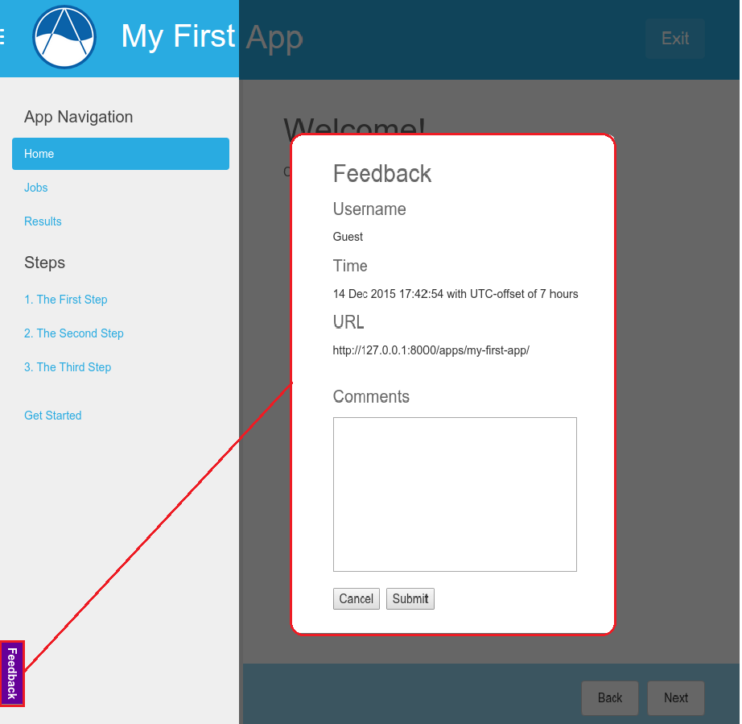

************
App Feedback
************

**Last Updated:** December 15, 2015

Tethys Portal includes a feature for enabling app feedback from the app-users. When activated, the feature shows a button on the bottom-left of each app page that activates a feedback form. The form is submitted to specified developers. The feature is supported starting in Tethys 1.3.0.

Enable Feedback
===================

Use the following instructions to setup the feedback form on a Tethys app.

  Add feedback properties to the :term:`app configuration file` (:file:`app.py`)

  Open the :term:`app configuration file` (:file:`app.py`) found in the app installation directory using a text editor and add the following properties to the ``TethysAppBase`` class. The ``feedback_emails`` should correspond to specific app developers that desire feedback.

      ::

            enable_feedback = True
            feedback_emails = ['app_developer@emaildomain.com', 'another_app__developer@emaildomain.com']

  .. note::

      The emails will only be sent if Step :ref:`setup_email_capabilities` has been setup upon installing Tethys.

      If either of the properties listed above are not defined or if ``enable_feedback`` is set to False, the feedback feature will not be available.

Example
++++++++++
  ::

      class App(TethysAppBase):
        """
        Tethys app class for My First App.
        """

        name = 'My First App'
        index = 'home'
        icon = 'my_first_app/images/icon.gif'
        package = 'my_first_app'
        root_url = 'my-first-app'
        color = '#29ABE1'
        enable_feedback = True
        feedback_emails = ['developer@myfirstapp.com']

