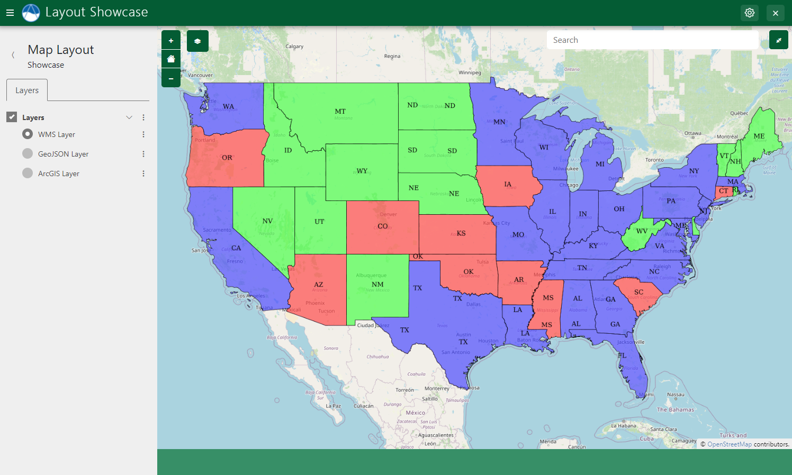
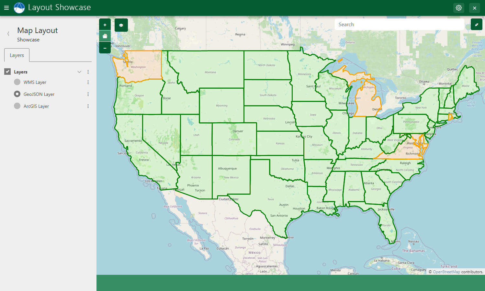
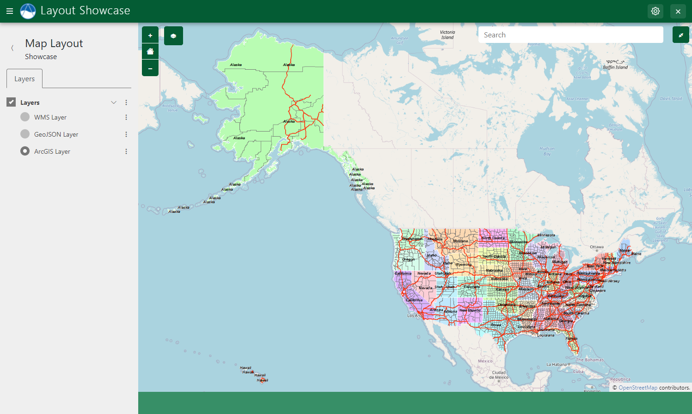
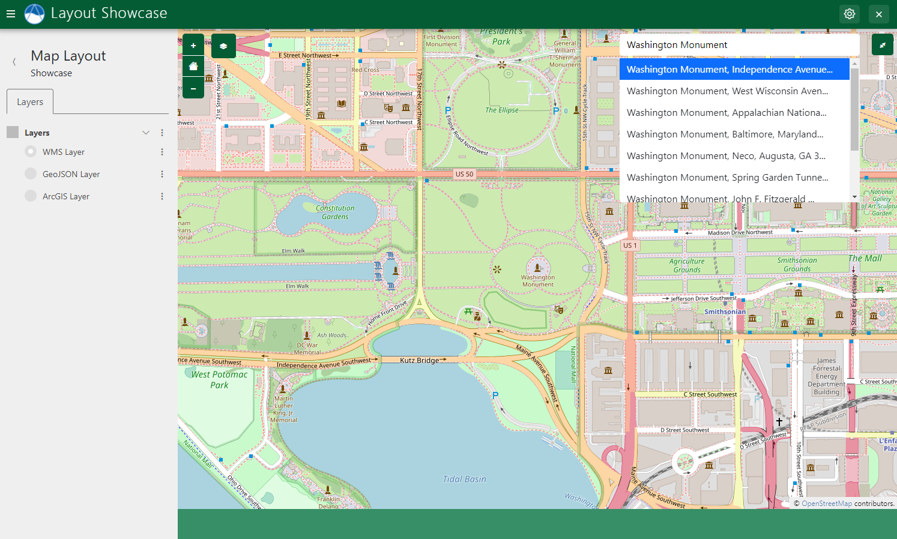

.. _map_layout:

**********
Map Layout
**********

**Last Updated:** May 2023

The ``MapLayout`` provides a drop-in full-screen map view for Tethys Apps. Displaying a map with a few layers can be accomplished in tens of lines of code and implementing more advanced functionality can be accomplished in hundreds. It includes a layer tree with visibility controls and actions such as "Zoom to Layer". The view can also includes many optional features such as displaying legends for layers, feature selection, map annotation / drawing tools, location lookup via geocoding, and a click-and-plot feature.

.. figure:: ./images/map_layout/map_layout.png
    :width: 800px
    :align: left

    **Figure 1**: Example map view created using Map Layout.

Setup
=====

Setting up a new ``MapLayout`` involves the following steps:

1. Create a new class in :file:`controllers.py` that inherits from ``MapLayout``.
2. Decorate the new class with the :ref:`controller-decorator` to set up routing. 
3. Configure the new ``MapLayout`` by setting properties on the new class. Review the :ref:`MapLayout properties <map_layout_properties>` for a full list. For example, set the ``map_title`` property to set the title of the view that appears in the navigation bar.

.. tip::

    Checkout the :ref:`Map Layout Tutorial <tutorial_map_layout>` for step-by-step instructions for using the ``MapLayout``.

The following example demonstrates how to create a new ``MapLayout`` view:

.. code-block:: python

    from django.urls import reverse_lazy
    from tethys_sdk.layouts import MapLayout
    from tethys_sdk.routing import controller

    @controller(
        name="map",
        url="my_first-app/map"
    )
    class MyMapLayout(MapLayout):
        app = app
        base_template = 'my_first_app/base.html'
        back_url = reverse_lazy('my_first_app:home')
        map_title = 'My Map Layout'
        map_subtitle = 'Subtitle'
        basemaps = [
            'OpenStreetMap',
            'ESRI'
        ]
        default_map_extent = [-65.69, 23.81, -129.17, 49.38]  # CONUS bbox
        max_zoom = 16
        min_zoom = 2

Add Layers
==========

To add layers to the map in a ``MapLayout``, override the :ref:`compose_layers <map_layout_compose_layers>` method. The ``MapLayout`` view uses the :ref:`MapView Gizmo <map-view>` under the covers and it is given to the ``compose_layers()`` method via the ``map_view`` argument. Use the ``map_view`` argument to add new :ref:`MVLayers <gizmo_mvlayer>` to the ``MapView``.

While the ``MapView`` Gizmo will be able to accept any ``MVLayer`` object, the ``MapLayout`` needs layers to have additional metadata attached for them to be recognized by the layers in the Layer Tree, legend, and other features of ``MapLayout``. Several helper methods are provided by ``MapLayout`` to assist with building ``MVLayer`` objects in the correct way: :ref:`build_wms_layer() <map_layout_build_wms_layer>`, :ref:`build_geojson_layer() <map_layout_build_geojson_layer>`, and :ref:`build_arc_gis_layer() <map_layout_build_arc_gis_layer>`.

In addition, the ``compose_layers()`` method needs to return a ``list`` of at least one Layer Group. A Layer Group contains a list of layers and is used by the Layer Tree of ``MapLayout`` to organize layers. In addition, a control type is specified for each Layer Group (``'check' or 'radio'``), and can be used to control whether all the layers in a Layer Group can be viewed simultaneously (``'check'``) or only one at a time (``'radio'``). Create Layer Groups using the :ref:`map_layout_build_layer_group` helper method.

WMS Layer
---------

    **Figure 2**: Example of a WMS layer displayed in a Map Layout.

The following example demonstrates how to add WMS layers to a ``MapLayout`` using the ``build_wms_layer`` method:

.. code-block:: python

    @controller(
        name="map",
        url="my_first-app/map"
    )
    class MyMapLayout(MapLayout):

        ...

        def compose_layers(self, request, map_view, *args, **kwargs):
            """
            Add layers to the MapLayout and create associated layer group objects.
            """
            # WMS Layer
            usa_population = self.build_wms_layer(
                endpoint='http://localhost:8181/geoserver/wms',
                server_type='geoserver',
                layer_name='topp:states',
                layer_title='USA Population',
                layer_variable='population',
                visible=True,  # Set to False if the layer should be hidden initially
            )

            # Add layer to map
            map_view.layers.append(usa_population)

            # Add layer to layer group
            layer_groups = [
                self.build_layer_group(
                    id='usa-layer-group',
                    display_name='United States',
                    layer_control='radio',  # 'radio' or 'check'
                    layers=[
                        usa_population,
                    ],
                ),
            ]

            return layer_groups

.. caution::

    The ellipsis (`...`) in code examples indicate code that is not shown for brevity. **DO NOT COPY VERBATIM**.

GeoJSON Layers
--------------

.. figure:: ./images/map_layout/map_layout_geojson_layer.png
    :width: 800px
    :align: left

    **Figure 3**: Example of a GeoJSON layer displayed in a Map Layout.

The following example demonstrates how to add a GeoJSON layer to a ``MapLayout`` using the ``build_geojson_layer`` method:

.. code-block:: python

    @controller(
        name="map",
        url="my_first-app/map"
    )
    class MyMapLayout(MapLayout):

        ...

        def compose_layers(self, request, map_view, *args, **kwargs):
            """
            Add layers to the MapLayout and create associated layer group objects.
            """
            # Load GeoJSON From File
            us_states_path = Path(app_workspace.path) / 'my_first_app' / 'us-states.json'
            with open(us_states_path) as gj:
                us_states_geojson = json.loads(gj.read())

            # GeoJSON Layer
            us_states_layer = self.build_geojson_layer(
                geojson=us_states_geojson,
                layer_name='us-states',
                layer_title='U.S. States',
                layer_variable='reference',
                visible=True,
            )

            # Add layer to map
            map_view.layers.append(us_states_layer)

            # Add layer to layer group
            ...

Vector Layer Styles
+++++++++++++++++++

    **Figure 4**: Example of a GeoJSON layer with custom styles displayed in a Map Layout.

Use the ``get_vector_style_map`` method of ``MapLayout`` to define custom styles for GeoJSON layers. The method expects a dictionary to be returned containing keys that coorespond to feature types (e.g.: "Point", "LineString", "Polygon") and values that are the style definition. The style definitions are created using a Python dictionary syntax that mirrors the `OpenLayers Style API <https://openlayers.org/en/latest/examples/geojson.html>`_. The For example:

.. code-block:: python

    @controller(
        name="map",
        url="my_first-app/map"
    )
    class MyMapLayout(MapLayout):

        ...
        @classmethod
        def get_vector_style_map(cls):
            return {
                'Point': {'ol.style.Style': {
                    'image': {'ol.style.Circle': {
                        'radius': 5,
                        'fill': {'ol.style.Fill': {
                            'color': 'red',
                        }},
                        'stroke': {'ol.style.Stroke': {
                            'color': 'red',
                            'width': 2
                        }}
                    }}
                }},
                'LineString': {'ol.style.Style': {
                    'stroke': {'ol.style.Stroke': {
                        'color': 'green',
                        'width': 3
                    }}
                }},
                'MultiPolygon': {'ol.style.Style': {
                    'stroke': {'ol.style.Stroke': {
                        'color': 'orange',
                        'width': 3
                    }},
                    'fill': {'ol.style.Fill': {
                        'color': 'rgba(255, 140, 0, 0.1)'
                    }}
                }},
                'Polygon': {'ol.style.Style': {
                    'stroke': {'ol.style.Stroke': {
                        'color': 'green',
                        'width': 3
                    }},
                    'fill': {'ol.style.Fill': {
                        'color': 'rgba(0, 255, 0, 0.1)'
                    }}
                }},
            }

ArcGIS REST Layer
-----------------

    **Figure 5**: Example of a ArcGIS layer displayed in a Map Layout.

The following example demonstrates how to add an ArcGIS REST layer to a ``MapLayout`` using the ``build_arc_gis_layer`` method:

.. code-block:: python

    @controller(
        name="map",
        url="my_first-app/map"
    )
    class MyMapLayout(MapLayout):

        ...

        def compose_layers(self, request, map_view, *args, **kwargs):
            """
            Add layers to the MapLayout and create associated layer group objects.
            """
            # ArcGIS Layer
            precip_layer = self.build_arc_gis_layer(
                endpoint='https://mapservices.weather.noaa.gov/raster/rest/services/obs/rfc_qpe/MapServer',
                layer_name='25',  # ArcGIS MapServer Layer ID
                layer_title='RFC QPE Last 24 Hours (inches)',
                layer_variable='precipitation',
                visible=False,
                extent=[-65.69, 23.81, -129.17, 49.38],  # CONUS bbox
            )

            # Add layer to map
            map_view.layers.append(precip_layer)

            # Add layer to layer group
            ...

.. _map_layout_feature_selection:

Feature Selection
=================

The ``MapLayout`` layout supports two modes of feature selection: Feature Selection for Vector Layers and Feature Selection for WMS Layers. Select features by clicking on the feature and select multiple layers by holding the ``SHIFT`` key while clicking on features.

Vector Layers
-------------

Vector layers, like GeoJSON layers, support Feature selection.

.. figure:: ./images/map_layout/map_layout_vector_feature_selection.png
    :width: 800px
    :align: left

    **Figure 6**: Vector layer feature selection in Map Layout.

Feature Selection for Vector Layers, such as GeoJSON layers, can be enabled on a layer-by-layer basis by setting the ``selectable`` argument to ``True``:

.. code-block:: python

    # Load GeoJSON From File
    us_states_path = Path(app_workspace.path) / 'my_first_app' / 'us-states.json'
    with open(us_states_path) as gj:
        us_states_geojson = json.loads(gj.read())

    # GeoJSON Layer
    us_states_layer = self.build_geojson_layer(
        geojson=us_states_geojson,
        layer_name='us-states',
        layer_title='U.S. States',
        layer_variable='reference',
        visible=True,
        selectable=True
    )

.. note::

    Clicking inside a polygon feature will not select it. Instead, click on the border of the polygon to select it.

JavaScript
++++++++++

Use the ``getSelectInteraction()`` method of the underlying ``MapView`` Gizmo to bind functions to the Vector feature selection event:

.. code-block:: javascript

    $(function() { // Wait for page to load
        let selection_interaction = TETHYS_MAP_VIEW.getSelectInteraction();

        // Called each time the select interaction's list of features changes
        selection_interaction.getFeatures().on('change:length', function(e) {
            // Check if there is at least 1 feature selected
            if (e.target.getLength() > 0) {
                // Do something with the feature
                let selected_feature = e.target.item(0); // 1st feature in Collection
                console.log(`Selected State: ${selected_feature.get('name')}`);
            }
        });
    });

.. tip::

    See the :ref:`layout_custom_template` section for how to define a custom template for a ``MapLayout`` and add custom JavaScript.

WMS Layers
----------

``MapLayout`` also supports feature selection for WMS layers that are hosted by a GeoServer and are derived from a vector source (e.g. created from a Shapefile or SQLView).

.. figure:: ./images/map_layout/map_layout_wms_feature_selection.png
    :width: 800px
    :align: left

    **Figure 7**: WMS layer feature selection in Map Layout.

Enabling feature selection is done on a layer by layer basis by setting the ``selectable`` argument to ``True`` as shown in the example below:

.. code-block:: python

    # WMS Layer
    usa_population = self.build_wms_layer(
        endpoint='http://localhost:8181/geoserver/wms',
        server_type='geoserver',
        layer_name='topp:states',
        layer_title='USA Population',
        layer_variable='population',
        visible=True,  # Set to False if the layer should be hidden initially
        selectable=True
    )

Geometry attribute
++++++++++++++++++

The ``build_wms_layer`` method takes an additional feature-selection related argument that is sometimes necessary: ``geometry attribute``. Use this argument to specify a different value if the partiuclar layer uses a different naming convention for the feature attribute that stores the geometry. The default value for ``geometry_attribute`` is ``"the_geom"``. For example:

.. code-block:: python

    # WMS Layer
    usa_population = self.build_wms_layer(
        endpoint='http://localhost:8181/geoserver/wms',
        server_type='geoserver',
        layer_name='topp:states',
        layer_title='USA Population',
        layer_variable='population',
        visible=True,  # Set to False if the layer should be hidden initially
        selectable=True,
        geometry_attribute='geometry',  # Defaults to "the_geom"
    )

Class Properties
++++++++++++++++

There are two class properties that can be used to modify the behavior of the WMS feature selection: ``feature_selection_multiselect`` and ``feature_selection_sensitivity``.

Set ``feature_selection_multiselect`` to ``True`` to allow selecting multiple features from WMS layers that have feature selection enabled. This is done by holding the ``SHIFT`` key while selecting. The default behavior is to allow only one feature to be selected at a time.

set the ``feature_selection_sensitivty`` to adjust the relative search radius around the clicked point of the selection algorithm. The default value is 4.

.. code-block:: python

    class MyMapLayout(MapLayout):
        feature_selection_multiselect = True
        feature_selection_sensitivty = 8

.. _map_layout_feature_selection_popups:

Property Popups
---------------

As the name suggestions, properties popups can be enabled to display properties of selected features in a popup dialog.

.. figure:: ./images/map_layout/map_layout_properties_popup.png
    :width: 800px
    :align: left

    **Figure 8**: Example of properties popup on a selected feature from a WMS layer.

Enable pop-ups displaying the properties of selected features by setting the ``show_properties_popup`` to ``True``.

.. code-block:: python

    class MyMapLayout(MapLayout):
        show_properties_popup = True

.. note::
    
    This feature only works for the layer types supported by :ref:`map_layout_feature_selection`.

Exclude properties from being displayed in the properties pop-ups using the ``excluded_properties`` argument of the build methods. The ``id``, ``type``, ``geometry``, ``the_geom``, and ``layer_name`` properties are automatically excluded.

.. code-block:: python

    # WMS Layer
    usa_population = self.build_wms_layer(
        endpoint='http://localhost:8181/geoserver/wms',
        server_type='geoserver',
        layer_name='topp:states',
        layer_title='USA Population',
        layer_variable='population',
        visible=True,  # Set to False if the layer should be hidden initially
        selectable=True,
        geometry_attribute='geometry',  # Defaults to "the_geom"
        excluded_properties=['STATE_FIPS', 'SUB_REGION'],
    )

.. note::

    Names of properties displayed in pop-ups have been reformatted by replacing any underscores (``_``) or hyphens (``-``) with spaces and changing the case to title case. For example, a property called ``STATE_FIPS`` would be displayed as ``State Fips``. You must specify the pre-formatted/original version of the property name for the ``excluded_properties`` argument.

.. caution::

    The Feature Selection Property Popup feature and the :ref:`map_layout_map_clicks_popups` feature cannot not be used together. When both are enabled, neither popup is displayed.

.. _map_layout_popup_javascript_api:

JavaScript
----------

The ``MapLayout`` JavaScript API provides several methods for controlling the properties popup. See: :ref:`map_layout_js_show_properties_popup`, :ref:`map_layout_js_close_properties_popup`, :ref:`map_layout_js_hide_properties_popup`, :ref:`map_layout_js_reset_properties_popup`, :ref:`map_layout_js_properties_table_generator`, :ref:`map_layout_js_custom_properties_generator`, and :ref:`map_layout_js_custom_properties_initializer`.

.. tip::

    See the :ref:`layout_custom_template` section for how to define a custom template for a ``MapLayout`` and add custom JavaScript.

.. _map_layout_map_clicks:

Map Clicks
==========

The Map Clicks feature of ``MapLayout`` will display a point at the location on the map where the user clicked. 

.. figure:: ./images/map_layout/map_layout_map_click.png
    :width: 800px
    :align: left

    **Figure 9**: Map clicks adds a point on the map at the location where the user last clicked on the map.

Enable Map Clicks by setting the ``show_map_clicks`` property of ``MapLayout`` to ``True``:

.. code-block:: python

    class MyMapLayout(MapLayout):
        show_map_clicks = True

.. _map_layout_map_clicks_popups:

Map Clicks Popups
-----------------

The Map Clicks Popups feature displays a popup pointing to the point at the location on the map where the user clicked. The popup is empty by default, but content can be added using JavaScript and the selector ``#properties-popup-content`` (see JavaScript section below). 

.. code-block:: python

    class MyMapLayout(MapLayout):
        show_map_clicks = True
        show_map_click_popup = True

.. caution::

    The Map Clicks Popup feature and the Feature Selection :ref:`map_layout_feature_selection_popups` feature cannot not be used together. When both are enabled, neither popup is displayed.

JavaScript
----------

Use the ``TETHYS_MAP_VIEW.mapClicked()`` method to respond to Map Click events. Pass a callback function that takes the coordinates of the clicked point as an argument:

.. code-block:: javascript

    $(function() {  // Wait for page to load
        // Map Click Event Handler
        TETHYS_MAP_VIEW.mapClicked(function(coords) {
            let popup_content = document.querySelector("#properties-popup-content");
            let lat_lon = ol.proj.transform(coords, 'EPSG:3857', 'EPSG:4326');
            let rounded_lat = Math.round(lat_lon[1] * 1000000) / 1000000;
            let rounded_lon = Math.round(lat_lon[0] * 1000000) / 1000000;
            popup_content.innerHTML = `<b>Coordinates:</b>
${rounded_lat}, ${rounded_lon}
`;
        });
    });

.. figure:: ./images/map_layout/map_layout_map_click_popup.png
    :width: 800px
    :align: left

    **Figure 10**: Example of custom content generated from JavaScript in the Map Click popup.

The ``show_properties_popup``, ``close_properties_popup``, ``hide_properties_popup``, and ``reset_properties_popup`` methods can be used to manipulate the Map Click popup (see: :ref:`Feature Selection > JavaScript <map_layout_popup_javascript_api>`).

.. tip::

    See the :ref:`layout_custom_template` section for how to define a custom template for a ``MapLayout`` and add custom JavaScript.

Click and Plot
==============

The Click and Plot capability of ``MapLayout`` can be used to plot data associated with individual features of a layer. The plots are powered by `PlotlyJS <https://plotly.com/javascript/>`_ and are displayed on a slide sheet that slides from the bottom of the map window.

.. figure:: ./images/map_layout/map_layout_click_n_plot.png
    :width: 800px
    :align: left

    **Figure 11**: The Click and Plot feature can be used to plot data associated with selected features.

Enable the Plot Slide Sheet by setting the ``plot_slide_sheet`` property to ``True``:

.. code-block:: python

    class MyMapLayout(MapLayout):
        plot_slide_sheet = True

Then enable the plot capability on one or more layers by setting the ``plottable`` argument to ``True``:

.. code-block:: python

    # WMS Layer
    usa_population = self.build_wms_layer(
        endpoint='http://localhost:8181/geoserver/wms',
        server_type='geoserver',
        layer_name='topp:states',
        layer_title='USA Population',
        layer_variable='population',
        visible=True,  # Set to False if the layer should be hidden initially
        selectable=True,
        plottable=True,
    )

.. note::
    
    This feature only works for the layer types supported by :ref:`map_layout_feature_selection`.

Finally, override the ``get_plot_for_layer_feature`` method of the ``MapLayout`` class. This method is called to retrive the plot data for a particular feature. The name of the layer and the id of the feature are given as arguments to allow for looking up the data dynamically.

The ``get_plot_for_layer_feature`` method should return three things:

* **title*** (str): The title of the plot slide sheet.
* **data** (list<dict>): A list of dictionaries containing the data series.
* **layout** (dict): A dictionary with layout options for the plot.

The data series and layout objects should be the Python equivalent of the Plotly JSON objects (see: `JavaScript Figure Reference | Plotly <https://plotly.com/javascript/reference/index/>`_).

In this example, the plot data is hard-coded for simplicity:

.. code-block:: python

    def get_plot_for_layer_feature(self, request, layer_name, feature_id, layer_data, feature_props, *args, **kwargs):
        """
        Retrieves plot data for given feature on given layer.

        Args:
            layer_name (str): Name/id of layer.
            feature_id (str): ID of feature.
            layer_data (dict): The MVLayer.data dictionary.
            feature_props (dict): The properties of the selected feature.

        Returns:
            str, list<dict>, dict: plot title, data series, and layout options, respectively.
        """
        # Define data
        month = ['January', 'February', 'March', 'April', 'May', 'June', 'July',
                'August', 'September', 'October', 'November', 'December']
        high_2000 = [32.5, 37.6, 49.9, 53.0, 69.1, 75.4, 76.5, 76.6, 70.7, 60.6, 45.1, 29.3]
        low_2000 = [13.8, 22.3, 32.5, 37.2, 49.9, 56.1, 57.7, 58.3, 51.2, 42.8, 31.6, 15.9]
        
        layout = {
            'xaxis': {
                'title': 'Month'
            },
            'yaxis': {
                'title': 'Temperature (degrees F)'
            }
        }

        data = [
            {
                'name': 'High 2000',
                'mode': 'lines',
                'x': month,
                'y': high_2000,
                'line': {
                    'dash': 'dot',
                    'width': 4,
                    'color': 'red'
                }
            }, {
                'name': 'Low 2000',
                'mode': 'lines',
                'x': month,
                'y': low_2000,
                'line': {
                    'dash': 'dot',
                    'width': 4,
                    'color': 'blue'
                }
            }
        ]
        return 'Average High and Low Temperatures', data, layout

JavaScript
----------

The plot slide sheet can be manipulated for more general purposes via the JavaScript API for ``MapLayout``. Ensure that the ``plot_slide_sheet`` property of the ``MapLayout`` class is set to ``True`` to enable this functionality. See: :ref:`map_layout_js_get_plot`, :ref:`map_layout_js_show_plot`, :ref:`map_layout_js_hide_plot`, :ref:`map_layout_js_update_plot`, :ref:`map_layout_js_plot_loader`, and :ref:`map_layout_js_plot_button_generator`.

.. tip::

    See the :ref:`layout_custom_template` section for how to define a custom template for a ``MapLayout`` and add custom JavaScript.

Address Search (Geocoding)
==========================

The Geocoding feature allows users to search for locations by street address or name. 

    **Figure 12**: Use the Geocoding capability of Map Layout to perform address and location search.

The geocoding capability is powered by the `OpenCage Geocoding API <https://opencagedata.com/>`_. You will need to `create an account on OpenCage <https://opencagedata.com/users/sign_up>`_ and `obtain an API key <https://opencagedata.com/api>`_. Then set the ``geocode_api_key`` to the value of your OpenCage API key:

.. code-block:: python

    class MyMapLayout(MapLayout):
        geocode_api_key = 'mY-@pI-k3y'

.. tip::

    Rather than store the API Key in plain text in your source code, you can store it as an app setting and retrieve it using this pattern:

    .. code-block:: python

        class MyMapLayout(MapLayout):

            @property
            def geocode_api_key(self):
                return self.app.get_custom_setting('open_cage_api_key')

Once the API key is set, a search box will appear on the ``MapLayout`` page. The search requires a minimum of 3 characters to be entered and no activity for 2 seconds before it attempts to search.

The search extent can be limited by providing setting the ``geocode_extent`` property:

.. code-block:: python

    class MyMapLayout(MapLayout):
        geocode_api_key = 'mY-@pI-k3y'
        geocode_extent = [-127.26563,23.56399,-66.09375,50.51343]

Permissions
===========

Some of the features of ``MapView`` can be restricted to users with certain permissions. To enable permissions enforcement, first set the ``enforce_permissions`` property to ``True``:

.. code-block:: python

    class MyMapLayout(MapLayout):
        enforce_permissions = True

Define the following permissions in the ``permissions()`` method of your app class (located in the :file:`app.py`):

.. code-block:: python

    from tethys_sdk.permissions import Permission, PermissionGroup

    class App(TethysAppBase):

        ...

        def permissions(self)
            # Define Permissions
            can_use_map_geocode = Permission(
                name='use_map_geocode',
                description='Can use the address search feature.'
            )

            can_use_map_plot = Permission(
                name='use_map_plot',
                description='Can use the click and plot capability.'
            )

            can_remove_layers = Permission(
                name='remove_layers',
                description='Can remove layerss'
            )

            can_rename_layers = Permission(
                name='rename_layers',
                description='Can rename layers.'
            )

            can_toggle_public_layer = Permission(
                name='toggle_public_layer',
                description='Can toggle the public toggle for layers.'
            )

            can_download = Permission(
                name='can_download',
                description='Can download layers.'
            )

            # Create map admin permission group
            map_admin_group = PermissionGroup(
                name='map_admin',
                permissions=(
                    can_use_map_geocode, can_use_map_plot, can_remove_layers,
                    can_rename_layers, can_toggle_public_layer, can_download
                )
            )

            return (map_admin_group,)

Finally, use the admin pages to assign individual permissions to users, create additional permissions groups, and assign them to users (see: :ref:`tethys_portal_auth_admin`).

Python API Documentation
========================

.. _map_layout_class:

MapLayout Class
---------------

.. _map_layout_properties:

Properties
++++++++++

The following properties can be overridden customize the behavior of the ``MapLayout``. It is recommended that the following properties be overridden every time: ``app``, ``base_template``, ``map_subtitle``, and ``map_title``.

.. autoclass:: tethys_layouts.views.map_layout.MapLayout

.. _map_layout_override_methods:

Override Methods
++++++++++++++++

Override these methods to customize the behavior of the ``MapLayout`` for your application. For example, override the ``compose_layers`` method to add layers to the ``MapLayout``.

.. _map_layout_compose_layers:

compose_layers
^^^^^^^^^^^^^^

.. automethod:: tethys_layouts.views.map_layout.MapLayout.compose_layers

get_plot_for_layer_feature
^^^^^^^^^^^^^^^^^^^^^^^^^^

.. automethod:: tethys_layouts.views.map_layout.MapLayout.get_plot_for_layer_feature

get_vector_style_map
^^^^^^^^^^^^^^^^^^^^

.. automethod:: tethys_layouts.views.map_layout.MapLayout.get_vector_style_map

should_disable_basemap
^^^^^^^^^^^^^^^^^^^^^^

.. automethod:: tethys_layouts.views.map_layout.MapLayout.should_disable_basemap

on_add_custom_layer
^^^^^^^^^^^^^^^^^^^

.. automethod:: tethys_layouts.views.map_layout.MapLayout.on_add_custom_layer

on_remove_tree_item
^^^^^^^^^^^^^^^^^^^

.. automethod:: tethys_layouts.views.map_layout.MapLayout.on_remove_tree_item

on_rename_tree_item
^^^^^^^^^^^^^^^^^^^

.. automethod:: tethys_layouts.views.map_layout.MapLayout.on_rename_tree_item

.. _map_layout_methods:

Helper Methods and Properties
+++++++++++++++++++++++++++++

These methods and properties simplify common workflows that are used in ``MapLayout`` implementations. Don't override these unless you know what you are doing.

build_map_extent_and_view
^^^^^^^^^^^^^^^^^^^^^^^^^

.. automethod:: tethys_layouts.views.map_layout.MapLayout.build_map_extent_and_view

.. _map_layout_build_wms_layer:

build_wms_layer
^^^^^^^^^^^^^^^

.. automethod:: tethys_layouts.views.map_layout.MapLayout.build_wms_layer

.. _map_layout_build_geojson_layer:

build_geojson_layer
^^^^^^^^^^^^^^^^^^^

.. automethod:: tethys_layouts.views.map_layout.MapLayout.build_geojson_layer

.. _map_layout_build_arc_gis_layer:

build_arc_gis_layer
^^^^^^^^^^^^^^^^^^^

.. automethod:: tethys_layouts.views.map_layout.MapLayout.build_arc_gis_layer

.. _map_layout_build_layer_group:

build_layer_group
^^^^^^^^^^^^^^^^^

.. automethod:: tethys_layouts.views.map_layout.MapLayout.build_layer_group

build_legend
^^^^^^^^^^^^

.. automethod:: tethys_layouts.views.map_layout.MapLayout.build_legend

generate_custom_color_ramp_divisions
^^^^^^^^^^^^^^^^^^^^^^^^^^^^^^^^^^^^

.. automethod:: tethys_layouts.views.map_layout.MapLayout.generate_custom_color_ramp_divisions

build_param_string
^^^^^^^^^^^^^^^^^^

.. automethod:: tethys_layouts.views.map_layout.MapLayout.build_param_string

convert_geojson_to_shapefile
^^^^^^^^^^^^^^^^^^^^^^^^^^^^

.. automethod:: tethys_layouts.views.map_layout.MapLayout.convert_geojson_to_shapefile

JavaScript API Documentation
============================

In addition to providing it's own JavaScript API, the ``MapLayout`` uses the ``MapView`` gizmo under the covers which means, many of the ``MapView`` gizmo JavaScript capabilities are applicable.

MapLayout
---------

Properties Popups
+++++++++++++++++

.. _map_layout_js_show_properties_popup:

show_properties_popup
^^^^^^^^^^^^^^^^^^^^^

**MAP_LAYOUT.show_properties_popup(coordinates)**

    Show the properties popup at the location given.

    **Parameters**

    * **coordinates** (*ol.geom.Point*|*Array*): An ``ol.goem.Point`` or an ``Array`` of length 2 (e.g. ``[-11981657.512845377, 4615036.7485996075]``). Coordinates should be specified in the ``EPSG:3857`` coordinate system.

.. _map_layout_js_close_properties_popup:

close_properties_popup
^^^^^^^^^^^^^^^^^^^^^^

**MAP_LAYOUT.close_properties_popup()** 

    Hides the properties popup and clears the features selected.

.. _map_layout_js_hide_properties_popup:

hide_properties_popup
^^^^^^^^^^^^^^^^^^^^^

**MAP_LAYOUT.hide_properties_popup()**

    Hides the properties popup without clearing selection.

.. _map_layout_js_reset_properties_popup:

reset_properties_popup
^^^^^^^^^^^^^^^^^^^^^^

**MAP_LAYOUT.reset_properties_popup()**

    Empties content of properties popup and then hides it.

.. _map_layout_js_properties_table_generator:

properties_table_generator
^^^^^^^^^^^^^^^^^^^^^^^^^^

**MAP_LAYOUT.properties_table_generator(f)**

    Override the default function that is used to generate the properties table that is displayed in the feature selection properties popup.

    **Parameters**

    * **function**: Provide a function that accepts two arguments, ``feature`` and ``layer``, and returns a string containing the HTML markup to insert into the popup.

.. _map_layout_js_custom_properties_generator:

custom_properties_generator
^^^^^^^^^^^^^^^^^^^^^^^^^^^

**MAP_LAYOUT.custom_properties_generator(f)**

    Define a function that is used to generate content to display in the popup after the properties table.

    **Parameters**

    * **f** (function): Provide a function that accepts two arguments, ``feature`` and ``layer``, and returns a string containing the HTML markup to insert in the popup after the properties table.

.. _map_layout_js_custom_properties_initializer:

custom_properties_initializer
^^^^^^^^^^^^^^^^^^^^^^^^^^^^^

**MAP_LAYOUT.custom_properties_initializer(f)**

    Define a function that performs initialization operations for custom content after the custom content markup is rendered (e.g. initialize a plot).

    **Parameters**

    * **f** (function): Provide a function that accepts no arguments and performs the initialization of custom content in the popup.

Plot Slide Sheet
++++++++++++++++

.. _map_layout_js_get_plot:

get_plot
^^^^^^^^

**MAP_LAYOUT.get_plot()**

    Return the selector for the Plotly plot element for use in Plotly functions.

.. _map_layout_js_show_plot:

show_plot
^^^^^^^^^

**MAP_LAYOUT.show_plot()**

    Open/show the slide sheet containing the plot.

.. _map_layout_js_hide_plot:

hide_plot
^^^^^^^^^

**MAP_LAYOUT.hide_plot()**

    Close/hide the slide sheet containing the plot.

.. _map_layout_js_update_plot:

update_plot
^^^^^^^^^^^

**MAP_LAYOUT.update_plot(title, data, layout)**

    Update the Plotly plot and slide sheet with the given title, data, and layout objects. Uses the ``Plotly.react()`` method to do this efficiently.

    **Parameters**

    * **title** (str): Title of the plot slide sheet.
    * **data** (array<object>): JavaScript array of objects, one for each data series.
    * **layout** (object): JavaScript object with Layout options for the plot.

.. _map_layout_js_plot_loader:

plot_loader
^^^^^^^^^^^

**MAP_LAYOUT.plot_loader(f)**

    Override the default plot loading function.

    **Parameters**

    * **f** (function): A JavaScript function to be called whenever plot data needs to be loaded. Must accept three arguments: ``plot_button``, ``layer_name``, and ``feature_id``.

.. _map_layout_js_plot_button_generator:

plot_button_generator
^^^^^^^^^^^^^^^^^^^^^

**MAP_LAYOUT.plot_button_generator(f)**

    Override the default plot button generator function. Useful for customizing the appearance, title, or behavior of the Plot button.

    **Parameters**

    * **f** (function): A JavaScript function to be called whenever the plot button needs to be generated. Must accept two arguments: ``feature`` and ``layer`` and return a string with HTML markup for the custom button.

MapView Gizmo
-------------

See: :ref:`MapView Gizmo JavaScript API <map_view_gizmo_js>`